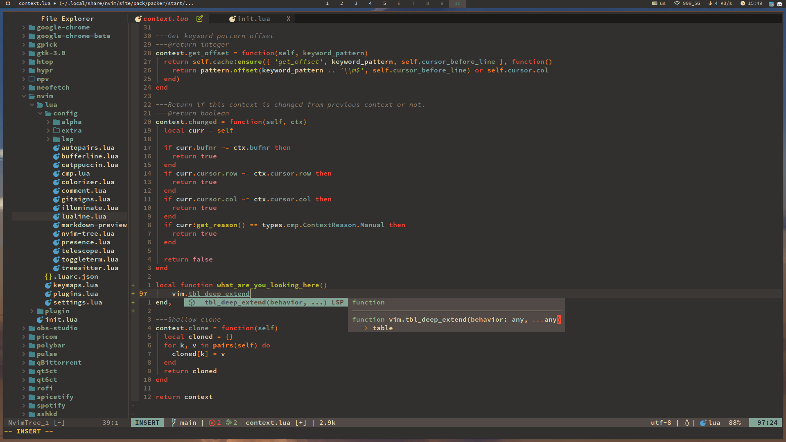
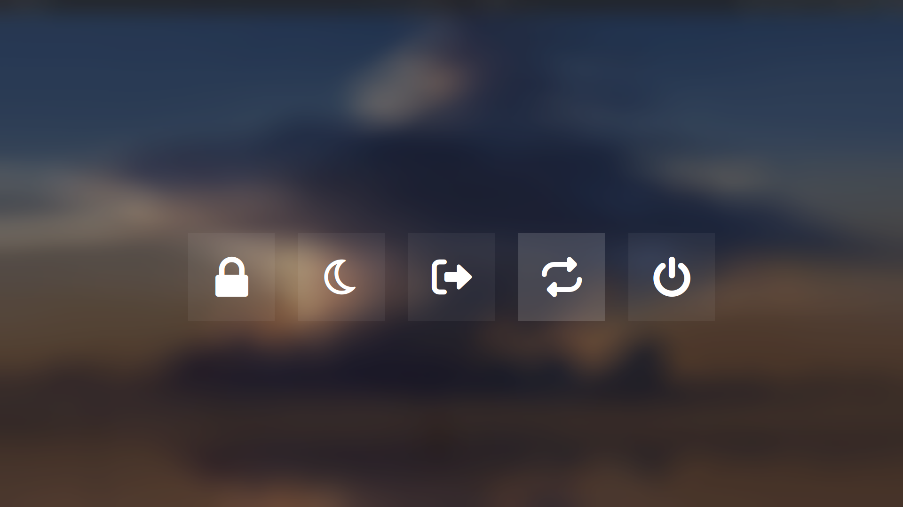

### 👋 Welcome to my profile

❗ I am a beginner Linux user. I am interested in studying the internals of the system and automating many processes. So far I don't know any programming language, but in the future I plan to start learning languages like JavaScript or Lua. I use Arch, btw.

 💻  If you are interested in knowing my workspace, then here are the characteristics of my laptop:

- Matebook 14 2020 AMD
- 8gb RAM
- 512gb ROM

**[OS Setup:](https://github.com/shvedes/dotfiles)**

 

|  |  |
| --- | --- | 

